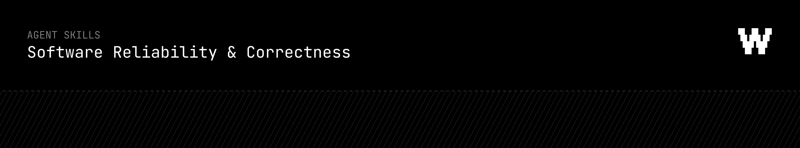

<div align="center">
  
</div>

# Better tests, not more tests

Most AI-written tests optimize for coverage. They assert implementation details, mock away the real risk, and pass even when the product breaks.

WIO is one testing workflow skill with four commands: `$wio scan`, `$wio test`, `$wio review`, and `$wio doctor`.

## Structure

WIO uses the standard agent skill shape: one skill, command routing inside `SKILL.md`, and one shared references tree.

```text
skills/wio/
  SKILL.md
  scripts/
    test-review-reminder.py
  references/
    index.md
    <topic>/
      overview.md
      tools.md
```

There are no separate `scan`, `test`, `review`, or `doctor` skills. There is no plugin wrapper. There are no copied reference trees.

## Host Files

Runtime subagents and hooks live in the official host directories:

```text
.claude/
  agents/
    wio-candidate-scout.md
    wio-strategy-critic.md
    wio-test-reviewer.md
  settings.json

.codex/
  agents/
    wio-candidate-scout.toml
    wio-strategy-critic.toml
    wio-test-reviewer.toml
  hooks.json
```

`npx skills add workersio/skills --skill wio` installs the skill only. It does not install project-level Claude or Codex runtime config. To use subagents and hooks, copy or commit the `.claude/` and `.codex/` directories as project files.

## Commands

| Command | What it does |
| --- | --- |
| `$wio scan [target]` | Maps product behavior, existing tests, CI, and risk areas to find the highest-value tests to add next. |
| `$wio test [target]` | Runs the full loop: discover candidate, pick strategy, write test, validate, review, then keep only if valuable. |
| `$wio review [target]` | Reviews a test for customer value, developer-flow value, signal quality, maintainability, and false confidence. |
| `$wio doctor [target]` | Audits test-suite health: weak assertions, flakes, excessive mocks, broad snapshots, slow feedback, skipped tests, and missing critical behavior coverage. |

## Subagents

WIO includes project subagents in `.claude/agents/` and `.codex/agents/`:

| Subagent | Role |
| --- | --- |
| `wio-candidate-scout` | Read-only discovery of high-value test candidates before implementation. |
| `wio-strategy-critic` | Read-only challenge of the selected strategy before editing tests. |
| `wio-test-reviewer` | Read-only post-write review that returns `KEEP`, `REDO`, or `REMOVE`. |

The main agent still writes the test. Subagents gather evidence, challenge the strategy, and review value. They do not duplicate reference content and they do not own the workflow.

Claude Code project subagents are Markdown files in `.claude/agents/`. Codex project subagents are TOML files in `.codex/agents/`.

## Hooks

WIO hooks are optional host config. They only remind the active agent to validate test changes and apply the WIO value gate. The executable hook logic lives in `skills/wio/scripts/test-review-reminder.py`.

## References

Detailed testing guidance lives only in `skills/wio/references/`.

Reference topics include:

| Area | Covers |
| --- | --- |
| Behavior mapping | Turning product behavior, workflows, APIs, and incidents into test candidates. |
| Risk-based testing | Prioritizing tests by customer impact, likelihood, confidence gap, and cost. |
| Test level selection | Choosing unit, component, integration, contract, E2E, monitoring, or specialized checks. |
| Oracles and assertions | Designing assertions that fail for real regressions and explain what broke. |
| Test data and fixtures | Setup, isolation, factories, seeds, cleanup, and state management. |
| Mocking and doubles | Preserving fidelity while keeping tests deterministic and fast. |
| Suite health | Finding flakes, weak signal, slow feedback, skipped tests, and CI blind spots. |
| Advanced strategies | Static analysis, security testing, fuzzing, property-based testing, mutation testing, performance testing, resilience testing, and regression selection. |

## Usage

```text
$wio scan checkout
$wio test billing eligibility regression
$wio review tests/billing_eligibility_test.py
$wio doctor API test suite
```

Use `scan` when you do not yet know what to test. Use `test` when you want the whole candidate-strategy-write-review loop. Use `review` when a test already exists or has just been written. Use `doctor` when an existing suite is hard to trust.

## What Good Means

A generated or recommended test should answer:

- What user, operator, customer, or API consumer failure does this prevent?
- What production, release, support, debugging, or review risk does it reduce?
- Would it fail for the regression that matters?
- Is the assertion specific enough to diagnose the broken behavior?
- Does the setup preserve the important dependency, state, permission, timing, or data risk?
- Does this belong in local development, PR CI, nightly, release, or production monitoring?

If those answers are weak, the test should be redesigned or removed.

## Contributing

Keep the public surface area small: one skill, `wio`, with command modes `scan`, `test`, `review`, and `doctor`.

Detailed testing guidance belongs in `skills/wio/references/`, not duplicated inside workflow files, plugin files, cloud folders, subagents, hooks, or extra skill trees. When adding a reference topic, add both `overview.md` and `tools.md`, then link it from `skills/wio/references/index.md`.

Host-specific files must stay minimal and point back to WIO:

- Claude Code subagents: project files live in `.claude/agents/` per the official Claude Code subagents docs.
- Claude Code hooks: project hook configuration lives in `.claude/settings.json` per the official Claude Code hooks docs.
- Codex subagents: project custom agents live in `.codex/agents/*.toml` per the official Codex subagents docs.
- Codex hooks: project hooks can live in `.codex/hooks.json` per the official Codex hooks docs.

References:

- Claude Code subagents: https://code.claude.com/docs/en/sub-agents
- Claude Code hooks: https://code.claude.com/docs/en/hooks
- Codex subagents: https://developers.openai.com/codex/subagents
- Codex hooks: https://developers.openai.com/codex/hooks

The quality bar is simple: do not accept tests for coverage alone. A test should reduce real user risk, production risk, support load, debugging time, review time, or release risk.

## License

[MIT](LICENSE)
